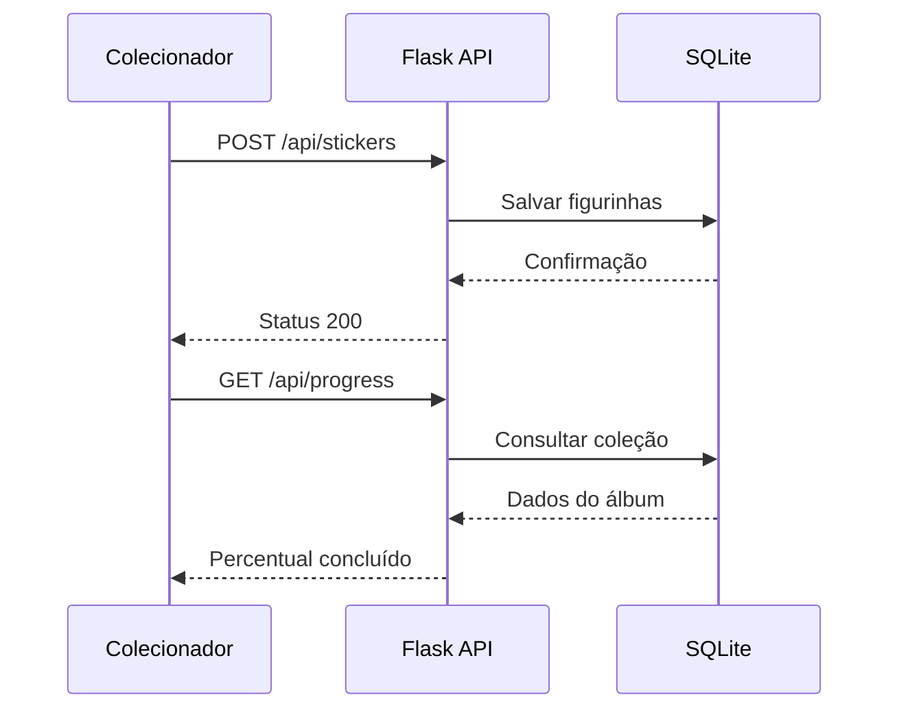

# 🗺️ 06-WIREFRAME_IDEAS.md: Arquitetura Visual e Esboços

## 📑 1. Objetivo da Arquitetura

Este documento define a experiência visual da Plataforma de Troca de Figurinhas da Copa do Mundo.

O objetivo é permitir que o usuário:

* Controle seu álbum.
* Visualize o progresso da coleção.
* Gerencie figurinhas repetidas.
* Encontre oportunidades de troca.
* Agende trocas com outros colecionadores.

A arquitetura deve seguir a Regra 80/20, focando apenas nas funcionalidades essenciais do MVP.

---

## 👥 2. Diagrama de Caso de Uso (DCU)

```mermaid
useCaseDiagram
    actor "Colecionador" as U

    package "Plataforma de Figurinhas" {

        usecase "Cadastrar Conta" as UC1
        usecase "Registrar Figurinhas" as UC2
        usecase "Cadastrar Repetidas" as UC3
        usecase "Visualizar Progresso do Álbum" as UC4
        usecase "Buscar Trocas" as UC5
        usecase "Agendar Troca" as UC6
    }

    U --> UC1
    U --> UC2
    U --> UC3
    U --> UC4
    U --> UC5
    U --> UC6
```

---

## 📱 3. Wireframe: Tela Principal (Mobile First)

### Header

* Logo da plataforma.
* Nome do usuário.
* Percentual do álbum concluído.

---

### Card de Progresso

Exibir:

* Total de figurinhas.
* Quantidade obtida.
* Quantidade faltante.
* Barra de progresso.

Exemplo:

```text
Álbum da Copa

✔ Obtidas: 520
❌ Faltantes: 160

[██████████░░░░░░]
76% Completo
```

---

### Área de Repetidas

Lista das figurinhas disponíveis para troca.

Exemplo:

```text
Repetidas

#15 Neymar
#87 Vinicius Jr
#310 Messi
```

---

### Área de Trocas

Exibir possíveis trocas compatíveis.

Exemplo:

```text
Carlos possui:

#88 Mbappé
#412 Bellingham

Deseja:

#15 Neymar
```

Botão:

```text
Propor Troca
```

---

## 🖥️ 4. Wireframe: Dashboard Desktop

### Painel Geral

Exibir:

* Usuários cadastrados.
* Trocas realizadas.
* Total de figurinhas cadastradas.

---

### Tabela de Trocas

Colunas:

* Usuário
* Figurinha Oferecida
* Figurinha Desejada
* Data
* Status

---

### Painel de Progresso

Ranking de colecionadores.

Exemplo:

| Usuário | Progresso |
| ------- | --------- |
| Carlos  | 92%       |
| Marina  | 81%       |
| Pedro   | 64%       |

---

## 🔄 5. Diagrama de Sequência



---

## 🎨 6. Mock Data e Estética

### Tema Visual

Inspirado na Copa do Mundo.

### Paleta

* Verde escuro
* Verde vibrante
* Dourado
* Branco

### Elementos

* Cartões inspirados em figurinhas.
* Bordas arredondadas.
* Ícones de trocas.
* Barra de progresso do álbum.

### Responsividade

Prioridade absoluta para telas de celular.

---

## 🛂 Instrução para a IA

"Lemuel, utilize este wireframe como referência principal para o frontend.

Priorize:

1. Progresso do álbum.
2. Gerenciamento de repetidas.
3. Busca de trocas.

Evite funcionalidades fora do MVP e mantenha aderência ao SCHEMA.md."
